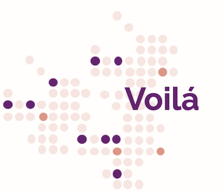

# Voilá &middot; 

> A practice project in JS that also helps me improve my french. The idea is to be able to store cue cards with the word in Portuguese and French. It should also be able to search words.

My ideia was to play around a little with Node/Express (no databases for me yet, sorry, it's just a lazy JSON file persisting the data) while also trying to build a project around MVC principles and exercise JavaScript.

The layout is all mine, the UI was planned out for desktop, but looks pretty ok in mobile screens too. [Here](https://xd.adobe.com/view/5e64c33a-845f-4174-a659-e459354ec29a-0b37/screen/a2c5cdf5-4c28-4334-bbeb-cb88cef50dbc/specs/) is the XD file with my original drawing and specs.

## Installing / Getting started

You should be able to run it locally after downloading the project, then running `npm install` followed by `npm start`. That should bring up the server for the API. I recommend using the Live Server extension (you can install it easily for vscode) and running live server to open the index.html file in your browser. Everything should hopefully work. I'll deploy a version soon for easier browsing.

## Developing

### Built With

This was built with Node/Express, JavaScript and VSCode.

## Licensing

This project is under an MIT licence, more details in the LICENSE file.
